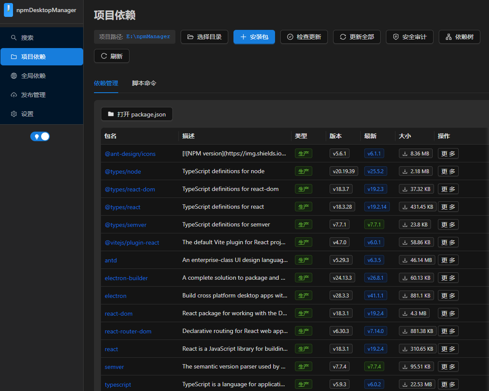
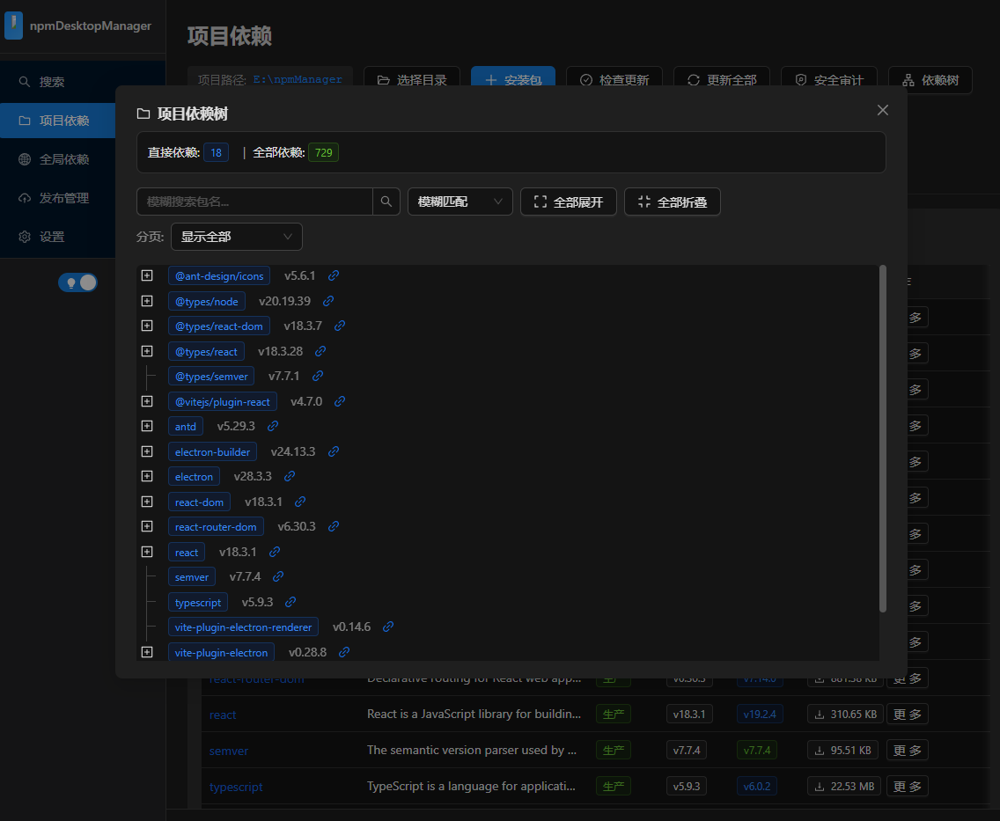
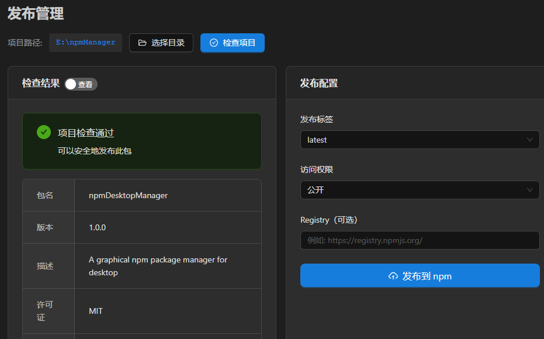
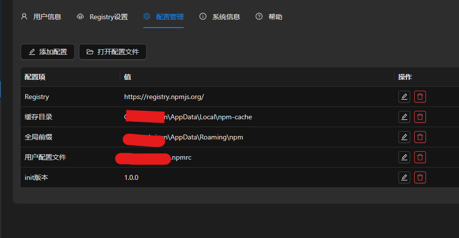

# npmDesktopManager

<div align="center">

A cross-platform desktop package manager for npm, pip, and Maven.

[](LICENSE)
[](https://www.electronjs.org/)
[](https://react.dev/)
[](https://ant.design/)
[](https://vite.dev/)

[English](#english) | [中文](#中文)

</div>

---

## English

### Overview

npmDesktopManager is a graphical desktop tool for managing JavaScript, Python, and Java dependencies from one consistent interface. It supports project dependencies, global environments, package search, publishing, security audits, dependency trees, and per-project toolchain versions for npm, pip, and Maven.

English is the default application language. Windows installers show a language selector during installation; portable builds and development builds ask for the interface language on first launch. The language can also be changed later in Settings.

### Highlights

- **Three peer package managers**: npm, pip, and Maven live as adjacent top-level entries with consistent management flows.
- **Unified dependency workflows**: project dependency detection, package install/update/remove, version switching, dependency tree viewing, outdated checks, and security audits.
- **Typed package search**: search npm, PyPI, or Maven packages with dynamic suggestions and manager-specific metadata.
- **Global and project scopes**: manage global tools and project-specific package manager settings without mixing scopes.
- **Tool version management**: bind different npm, Python/pip, or Maven executables globally or per project.
- **Publishing workflows**: publish npm packages, Python packages to PyPI/TestPyPI/custom repositories, and Maven artifacts to configured remote repositories.
- **Self-repair support**: pip dependency checks and audit tooling can install or repair missing prerequisites before running workflows.
- **Localization**: English and Simplified Chinese UI, Ant Design locale switching, Electron menu localization, and first-run language selection.
- **Cleaner command output**: improved Windows command decoding for UTF-8/GB18030 output and safer `.cmd` execution without `shell: true`.
- **Packaging optimization**: asar packaging, maximum compression, renderer chunk splitting, and installer language metadata.

### Package Manager Capabilities

#### npm

- Search npm packages and inspect details, versions, README, changelog links, dependents, and package size.
- Manage project dependencies and global packages.
- Install, uninstall, update, move dependencies between production and development scopes, and batch update packages.
- Run project scripts and open project terminals.
- View project/global dependency trees.
- Run `npm audit` and audit fixes from the UI.
- Manage npm registry, cache, user login, npm config, and published package metadata.

#### pip

- List, install, uninstall, update, and batch update packages in the current Python environment or user scope.
- Search PyPI packages with dynamic suggestions.
- Read, install, and export `requirements.txt`.
- Run `pip check`, dependency self-repair, `pip-audit`, and `pipdeptree`.
- Manage pip config scopes, cache, mirrors, custom index URLs, trusted hosts, and publishing credentials.
- Publish Python packages after optional build steps.

#### Maven

- Detect `pom.xml`, list dependencies, and show structured dependency trees.
- Add/remove dependencies with groupId/artifactId suggestions from the current project, local `.m2` repository, and Maven Central.
- Load available versions and switch dependency versions.
- Run common or custom Maven goals.
- Manage local repository location, mirrors, `settings.xml` backups, server credentials, and deploy repositories.
- Prepare offline dependencies, purge local repository cache, and run OWASP dependency-check based security audits.

### Screenshots

The repository includes historical screenshots that can be updated as the UI evolves:






### Tech Stack

- **Desktop**: Electron 42
- **Frontend**: React 19 + TypeScript 6
- **UI**: Ant Design 6 + CSS Modules
- **State**: Zustand 5
- **Build**: Vite 8 + vite-plugin-electron
- **Packaging**: electron-builder 26

### Installation & Development

```bash
# Clone the repository
git clone https://github.com/yixunfei/npmDesktopManager.git

# Enter the project
cd npmDesktopManager

# Install dependencies
npm install

# Start development server
npm run dev
```

Optional icon generation:

```bash
npm run build:icons
```

### Build

```bash
# Production build and package for the current platform
npm run dist

# Windows
npm run build:win
npm run build:win-installer
npm run build:win-portable

# macOS
npm run build:mac
npm run build:mac-dmg
npm run build:mac-zip

# Linux
npm run build:linux
npm run build:linux-appimage
npm run build:linux-deb

# All configured platforms
npm run build:all
```

### Release

```bash
npm run release
npm run release:all
```

### Project Structure

```text
npmDesktopManager/
├── build/                 # electron-builder resources and NSIS customization
├── electron/              # Electron main process and backend services
│   ├── main.ts            # Main process entry, IPC, window, menu, language bootstrap
│   ├── preload.ts         # Secure renderer bridge
│   └── services/          # npm, pip, Maven, system, terminal, publish, toolchain services
├── src/                   # React renderer
│   ├── components/        # Layout, localization, package, project path, toolchain UI
│   ├── hooks/             # Shared hooks
│   ├── pages/             # Search, manager, global, publish, settings, tool version pages
│   ├── stores/            # Zustand state
│   ├── styles/            # Global styles
│   ├── types/             # Renderer global types
│   └── i18n.ts            # UI dictionaries and runtime text localization
├── scripts/               # Build, release, and icon scripts
├── dist/                  # Renderer build output
├── dist-electron/         # Electron build output
└── release/               # Packaged application output
```

### Troubleshooting

- **npm information is unavailable in Settings**: check the global or project npm tool path in Tool Versions. The settings page now shows partial system information even when npm itself is unavailable.
- **Windows command output is garbled**: command output is decoded with UTF-8/GB18030 scoring. Configure terminals and package managers to UTF-8 when possible for best results.
- **pip audit tools are missing**: use the pip manager's audit/self-repair actions to install or repair `pip-audit` and `pipdeptree`.
- **Maven search is slow**: local `.m2` scanning depends on repository size. Remote Maven Central results are merged with local and project dependencies.
- **Chromium network noise on Windows**: low-level Chromium network logs are suppressed by default. Set `ELECTRON_ENABLE_CHROMIUM_LOGGING=1` before launch if you need those logs for debugging.

### Contributing

Issues and pull requests are welcome.

1. Fork this repository.
2. Create a feature branch.
3. Run `npm run build` before submitting.
4. Open a pull request with a clear summary and verification notes.

### License

This project is licensed under the MIT License. See [LICENSE](LICENSE).

---

## 中文

### 简介

npmDesktopManager 是一个跨平台桌面端包管理工具，面向 npm、pip、Maven 三类生态提供统一的图形化管理体验。它支持项目依赖、全局环境、包搜索、发布管理、安全审计、依赖树、以及按项目绑定不同工具版本。

程序默认语言为英语。Windows 安装包会在安装时选择语言；便携版和开发模式会在首次启动时选择语言。之后也可以在设置页中切换 English / 简体中文。

### 核心特性

- **三类管理器平级入口**：npm、pip、Maven 在左侧菜单中相邻展示，交互结构统一。
- **统一依赖工作流**：项目依赖识别、安装、更新、卸载、版本切换、依赖树、过期检查和安全审计。
- **按类型搜索**：搜索时选择 npm、pip 或 Maven，并提供动态搜索建议和对应生态元信息。
- **全局与项目管理**：区分全局工具配置和项目级覆盖，避免不同项目互相影响。
- **项目工具版本**：可为不同项目绑定不同 npm、Python/pip、Maven 路径，满足最低版本或环境隔离要求。
- **发布管理**：支持 npm 发布、Python 包发布到 PyPI/TestPyPI/自定义仓库、Maven deploy 到远程仓库。
- **自我修复**：pip 依赖检查、安全审计和依赖树工具缺失时，可优先安装或修复前置依赖。
- **多语言本地化**：支持英语和简体中文，包含 Ant Design 组件、Electron 菜单、首次启动语言选择和运行时文本本地化。
- **命令输出优化**：改善 Windows 下 UTF-8/GB18030 输出解码，并移除 `.cmd` 命令执行中的 `shell: true` 弃用警告。
- **打包优化**：启用 asar、maximum compression、前端 chunk 拆分和 NSIS 安装器语言配置。

### 管理能力

#### npm

- 搜索 npm 包，查看详情、版本、README、更新日志入口、被依赖数量和包体积。
- 管理项目依赖和全局依赖。
- 安装、卸载、更新、依赖类型移动、批量更新。
- 运行项目脚本并打开项目终端。
- 查看项目/全局依赖树。
- 执行 `npm audit` 和自动修复。
- 管理 registry、缓存、登录、npm config 和已发布包信息。

#### pip

- 在当前环境或用户范围列出、安装、卸载、升级和批量升级包。
- 搜索 PyPI 包并展示动态建议。
- 读取、安装和导出 `requirements.txt`。
- 执行 `pip check`、依赖自修复、`pip-audit` 和 `pipdeptree`。
- 管理 pip 配置作用域、缓存、镜像源、自定义 index URL、trusted host 和发布凭据。
- 支持构建后发布 Python 包。

#### Maven

- 识别 `pom.xml`，列出依赖并结构化展示依赖树。
- 添加/移除依赖，基于当前项目、本地 `.m2` 仓库和 Maven Central 提供 groupId/artifactId 动态建议。
- 获取可用版本并切换依赖版本。
- 执行常用或自定义 Maven goal。
- 管理本地仓库、镜像、`settings.xml` 备份、server 凭据和 deploy 仓库。
- 支持离线依赖准备、本地仓库缓存清理和 OWASP dependency-check 安全审计。

### 截图

仓库中保留了历史截图，可随 UI 继续更新：


### 技术栈

- **桌面框架**：Electron 42
- **前端**：React 19 + TypeScript 6
- **UI**：Ant Design 6 + CSS Modules
- **状态管理**：Zustand 5
- **构建工具**：Vite 8 + vite-plugin-electron
- **打包工具**：electron-builder 26

### 安装与开发

```bash
# 克隆仓库
git clone https://github.com/yixunfei/npmDesktopManager.git

# 进入目录
cd npmDesktopManager

# 安装依赖
npm install

# 启动开发服务
npm run dev
```

可选图标生成：

```bash
npm run build:icons
```

### 构建

```bash
# 当前平台生产构建和打包
npm run dist

# Windows
npm run build:win
npm run build:win-installer
npm run build:win-portable

# macOS
npm run build:mac
npm run build:mac-dmg
npm run build:mac-zip

# Linux
npm run build:linux
npm run build:linux-appimage
npm run build:linux-deb

# 所有配置平台
npm run build:all
```

### 发布

```bash
npm run release
npm run release:all
```

### 项目结构

```text
npmDesktopManager/
├── build/                 # electron-builder 资源和 NSIS 自定义脚本
├── electron/              # Electron 主进程与后端服务
│   ├── main.ts            # 主进程入口、IPC、窗口、菜单和语言初始化
│   ├── preload.ts         # 安全的渲染进程桥接
│   └── services/          # npm、pip、Maven、系统、终端、发布、工具链服务
├── src/                   # React 渲染进程
│   ├── components/        # 布局、本地化、包管理、项目路径、工具链组件
│   ├── hooks/             # 共享 Hook
│   ├── pages/             # 搜索、管理器、全局、发布、设置、工具版本页面
│   ├── stores/            # Zustand 状态
│   ├── styles/            # 全局样式
│   ├── types/             # 渲染进程类型
│   └── i18n.ts            # 词典和运行时文本本地化
├── scripts/               # 构建、发布和图标脚本
├── dist/                  # 渲染进程构建产物
├── dist-electron/         # Electron 构建产物
└── release/               # 应用打包输出
```

### 常见问题

- **设置页 npm 信息不可用**：检查“项目工具版本”或“全局工具版本”中的 npm 路径。即使 npm 不可用，设置页也会继续显示 Node/Electron/平台信息。
- **Windows 命令输出乱码**：程序会对 UTF-8/GB18030 输出进行识别解码。建议终端和包管理器尽量配置为 UTF-8。
- **pip 审计工具缺失**：使用 pip 管理中的审计或自修复功能安装/修复 `pip-audit` 和 `pipdeptree`。
- **Maven 搜索较慢**：本地 `.m2` 扫描速度取决于仓库体积；远程 Maven Central 结果会与本地和项目依赖合并。
- **Windows Chromium 网络日志噪声**：默认会压低底层 Chromium 网络日志；需要调试时可设置 `ELECTRON_ENABLE_CHROMIUM_LOGGING=1` 后启动。

### 贡献

欢迎提交 Issue 和 Pull Request。

1. Fork 本仓库。
2. 创建功能分支。
3. 提交前运行 `npm run build`。
4. 在 Pull Request 中说明变更内容和验证方式。

### 许可证

本项目使用 MIT 许可证，详见 [LICENSE](LICENSE)。
