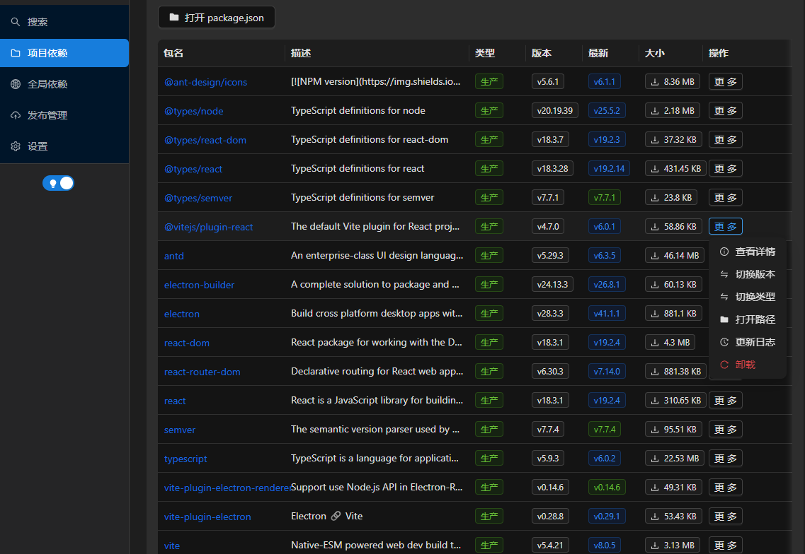
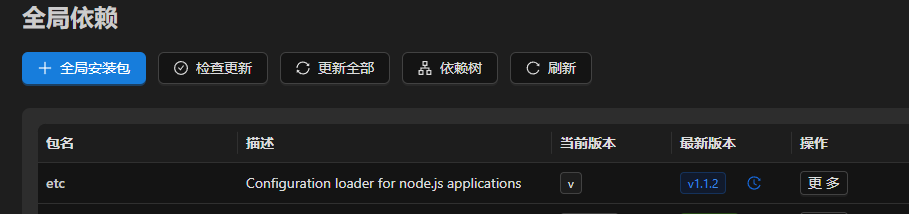
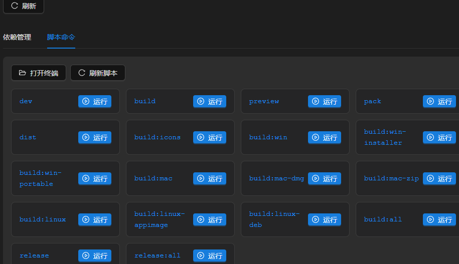

# npmDesktopManager

<div align="center">

一个现代化、跨平台的 npm 包管理桌面应用

[](https://opensource.org/licenses/MIT)
[](https://www.electronjs.org/)
[](https://reactjs.org/)

[English](#english) | [中文](#中文)

</div>

---

## 中文

### 简介

npmDesktopManager 是一个功能丰富的图形化 npm 包管理工具，为开发者提供直观的界面来管理项目依赖和全局包。支持 Windows、macOS 和 Linux 平台。

### 功能特性

#### 📦 包管理
- **包搜索** - 快速搜索 npm 包，查看详细信息、版本历史、依赖关系
- **项目依赖管理** - 管理项目依赖（dependencies、devDependencies、peerDependencies）
- **全局依赖管理** - 查看和管理全局安装的 npm 包
- **批量操作** - 批量安装、更新、卸载包



#### 🔍 分析工具
- **依赖树分析** - 可视化查看项目的依赖树结构
- **安全审计** - 检测项目中的安全漏洞，一键修复
- **版本检查** - 检查过时的依赖包，一键更新





#### 🚀 发布管理
- **npm 发布** - 发布包到 npm 或私有仓库
- **多仓库支持** - 支持切换不同的 npm 源
- **版本管理** - 查看和安装指定版本的包


#### ⚙️ 系统配置
- **npm 配置管理** - 查看和修改 npm 配置
- **主题切换** - 支持亮色和暗色主题
- **缓存管理** - 查看、修改和清理 npm 缓存

](image-5.png)

### 技术栈

- **框架**: Electron 28+
- **前端**: React 18 + TypeScript
- **UI组件**: Ant Design 5.x
- **状态管理**: Zustand
- **构建工具**: Vite 5
- **打包工具**: electron-builder

### 安装使用

#### 开发环境

```bash
# 克隆仓库
git clone https://github.com/yourusername/npmDesktopManager.git

# 进入项目目录
cd npmDesktopManager

# 安装依赖
npm install

# 生成图标（需要 ImageMagick）
npm run build:icons

# 启动开发服务器
npm run dev
```

#### 构建应用

```bash
# 构建当前平台
npm run dist

# 构建特定平台
npm run build:win          # Windows (安装版 + 便携版)
npm run build:win-installer # Windows 安装版
npm run build:win-portable  # Windows 便携版
npm run build:mac           # macOS (DMG + ZIP)
npm run build:linux         # Linux (AppImage + DEB + RPM)

# 构建所有平台
npm run build:all
```

#### 发布版本

```bash
# 发布当前平台版本
npm run release

# 发布所有平台版本
npm run release:all
```

### 项目结构

```
npmDesktopManager/
├── electron/              # Electron 主进程代码
│   ├── main.ts           # 主进程入口
│   ├── preload.ts        # 预加载脚本
│   └── services/         # 后端服务
│       ├── npm.ts        # npm 命令封装
│       ├── project.ts    # 项目操作
│       ├── publish.ts    # 发布管理
│       ├── system.ts     # 系统命令
│       └── watcher.ts    # 文件监听
├── src/                   # React 渲染进程代码
│   ├── components/       # React 组件
│   │   ├── Layout/       # 布局组件
│   │   ├── Notification/ # 通知组件
│   │   └── Package/      # 包相关组件
│   ├── pages/            # 页面组件
│   │   ├── Search/       # 搜索页面
│   │   ├── Project/      # 项目管理页面
│   │   ├── Global/       # 全局包管理页面
│   │   ├── Publish/      # 发布管理页面
│   │   └── Settings/     # 设置页面
│   ├── stores/           # Zustand 状态管理
│   ├── styles/           # 全局样式
│   └── types/            # TypeScript 类型定义
├── scripts/              # 构建和发布脚本
│   ├── build.js          # 构建脚本
│   ├── release.js        # 发布脚本
│   └── generate-icons-simple.js # 图标生成脚本
├── build/                # 构建资源
│   └── icons/            # 应用图标
├── dist/                  # 渲染进程构建输出
├── dist-electron/         # 主进程构建输出
└── release/              # 打包输出目录
```

### 开发指南

#### 代码规范

- 使用 TypeScript 编写所有代码
- 组件使用函数式组件 + Hooks
- 样式使用 CSS Modules
- 提交信息遵循 Conventional Commits

#### 分支管理

- `main` - 主分支，稳定版本
- `develop` - 开发分支
- `feature/*` - 功能分支
- `bugfix/*` - 修复分支

### 常见问题

#### 1. 图标显示异常

运行 `npm run build:icons` 生成应用图标（需要 ImageMagick）。

如果没有 ImageMagick，可以：
- 手动创建 `build/icons/icon.ico` (Windows)
- 手动创建 `build/icons/icon.icns` (macOS)
- 使用在线工具转换图标

#### 2. 开发模式下图标不显示

开发模式下使用默认 Electron 图标是正常的，打包后图标会正确显示。

#### 3. 依赖安装失败

尝试删除 `node_modules` 和 `package-lock.json`，然后重新运行 `npm install`。

### 系统要求

#### Windows
- Windows 7 或更高版本
- 64 位系统

#### macOS
- macOS 10.13 (High Sierra) 或更高版本
- Intel 或 Apple Silicon 处理器

#### Linux
- glibc 2.17 或更高版本
- 64 位系统

### 贡献指南

欢迎提交 Issue 和 Pull Request！

1. Fork 本仓库
2. 创建特性分支 (`git checkout -b feature/AmazingFeature`)
3. 提交更改 (`git commit -m 'Add some AmazingFeature'`)
4. 推送到分支 (`git push origin feature/AmazingFeature`)
5. 创建 Pull Request

### 许可证

本项目采用 MIT 许可证 - 详见 [LICENSE](LICENSE) 文件

### 致谢

- [Electron](https://www.electronjs.org/)
- [React](https://reactjs.org/)
- [Ant Design](https://ant.design/)
- [Zustand](https://github.com/pmndrs/zustand)
- [Vite](https://vitejs.dev/)

---

## English

### Introduction

npmDesktopManager is a feature-rich graphical npm package manager that provides an intuitive interface for developers to manage project dependencies and global packages. Supports Windows, macOS, and Linux platforms.

### Features

#### 📦 Package Management
- **Package Search** - Quickly search npm packages, view details, version history, dependencies
- **Project Dependency Management** - Manage project dependencies (dependencies, devDependencies, peerDependencies)
- **Global Dependency Management** - View and manage globally installed npm packages
- **Batch Operations** - Batch install, update, uninstall packages

#### 🔍 Analysis Tools
- **Dependency Tree Analysis** - Visualize project dependency tree structure
- **Security Audit** - Detect security vulnerabilities in projects, one-click fix
- **Version Check** - Check outdated dependencies, one-click update

#### 🚀 Publishing Management
- **npm Publishing** - Publish packages to npm or private repositories
- **Multi-registry Support** - Support switching between different npm sources
- **Version Management** - View and install specific versions of packages

#### ⚙️ System Configuration
- **npm Config Management** - View and modify npm configuration
- **Theme Switching** - Support light and dark themes
- **Cache Management** - View, modify, and clean npm cache

### Tech Stack

- **Framework**: Electron 28+
- **Frontend**: React 18 + TypeScript
- **UI Components**: Ant Design 5.x
- **State Management**: Zustand
- **Build Tool**: Vite 5
- **Packaging**: electron-builder

### Installation & Usage

#### Development

```bash
# Clone repository
git clone https://github.com/yourusername/npmDesktopManager.git

# Enter project directory
cd npmDesktopManager

# Install dependencies
npm install

# Generate icons (requires ImageMagick)
npm run build:icons

# Start development server
npm run dev
```

#### Build Application

```bash
# Build for current platform
npm run dist

# Build for specific platforms
npm run build:win          # Windows (installer + portable)
npm run build:win-installer # Windows installer only
npm run build:win-portable  # Windows portable only
npm run build:mac           # macOS (DMG + ZIP)
npm run build:linux         # Linux (AppImage + DEB + RPM)

# Build for all platforms
npm run build:all
```

#### Release Version

```bash
# Release current platform version
npm run release

# Release all platform versions
npm run release:all
```

### System Requirements

#### Windows
- Windows 7 or later
- 64-bit system

#### macOS
- macOS 10.13 (High Sierra) or later
- Intel or Apple Silicon processor

#### Linux
- glibc 2.17 or later
- 64-bit system

### Contributing

Issues and Pull Requests are welcome!

1. Fork this repository
2. Create feature branch (`git checkout -b feature/AmazingFeature`)
3. Commit changes (`git commit -m 'Add some AmazingFeature'`)
4. Push to branch (`git push origin feature/AmazingFeature`)
5. Create Pull Request

### License

This project is licensed under the MIT License - see [LICENSE](LICENSE) file for details

---

<div align="center">

Made with ❤️ by npmDesktopManager Team

</div>